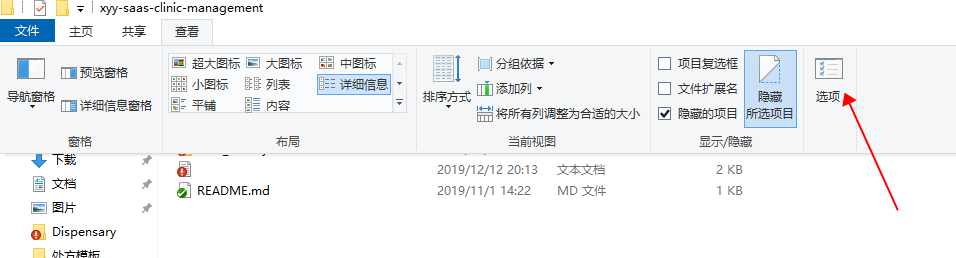
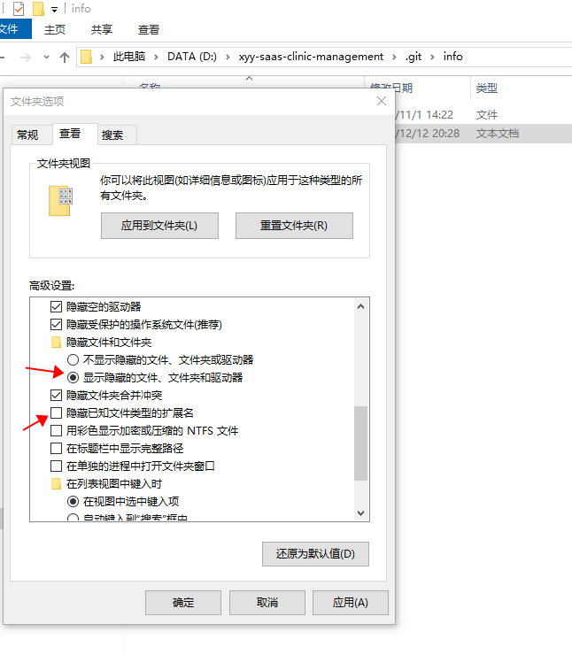

#### 拉去代码，提示Git pull error: unable to create file/img/xx.png (Invalid argument)
我遇到的问题，是因为一些文件（没有扩展名或者是其他问题）导致无法同步到windows机器上
**解决方案：**
**第一步，菜单找到选项**

**第二步，选择显示隐藏的文件、去掉 隐藏已知文件类型的扩展名**

**第三步，进入项目配置**
进入 .git目录并打开 config文件。在[core]段添加下面的行：
```
  sparsecheckout = true
```
.git/info目录并创建 sparse-checkout文件。加入下面这些：
```
*
!file/img/*
```
第一行包含任何字符，
第二行不包含在 file/img/里面的所有文件，**文件路径写你自己的**
**第四步，重启git工具**