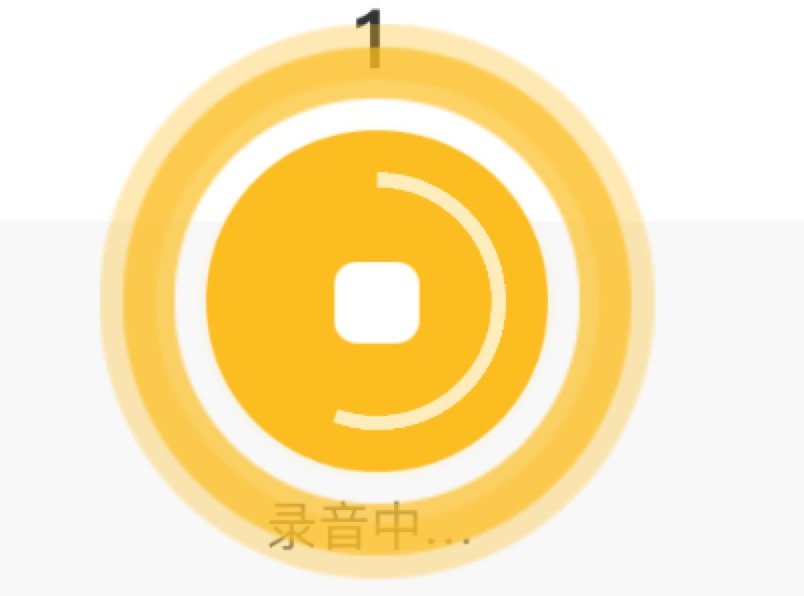

##canvas圆形进度

```html
    <!-- 定义canvas ，宽度双倍大小-->
    <canvas id="drawing" width="280" height="280"></canvas>
```
```css
//解决移动端下出现锯齿的问题，放大一倍再缩小
#drawing{
    /* 其实canvas元素是140px的正方形，这里设置了2倍大小 */
    width:280px;height:280px;
    /* 然后这里给元素压缩一半，实际还是显示140px */
    transform:scale(0.5) translate3d(-50%,-50%,0);
}
```
```js
import {
    drawCircle
} from "../../common/util.js";
data(){
    return {
        draw:null,
    }
},
mounted() {
    //纯函数-缓存画圆函数
    this.draw=drawCircle('drawing','#FFECBD');
},
methods:{
    ...
    //开始画图，then监听定时器走完
    this.draw.start().then(()=>{
        // 这里处理定时器走完后的业务
    });
    ...
    // 人为暂停定时器
    this.draw.stop();
}
```
```js
//  drawCircle-绘制圆环进度条
export function drawCircle(canvasId,c_color){
    let timer=null,
        drawing = document.getElementById(canvasId),
        context=drawing.getContext('2d');
    // 使用纯函数的逻辑，是为了预存函数，方便开启动画或者停止动画
    return {
        start(){
            if(timer) return;
            return new Promise((resolve,reject)=>{
                var st=new Date().getTime();
                var radius = drawing.height/2 - 10,//半径
                        ox = radius+10, oy = radius+10;//圆心
                let i=0,
                    end=360*2;
                // 先清画布，然后再绘制
                context.clearRect(0,0,drawing.width,drawing.height);
                timer=setInterval(function circle(){
                    i+=10;
                    //画一个空心圆
                    context.beginPath();
                    context.arc(ox,oy,radius,(-180/360)*Math.PI,((-180+i)/360)*Math.PI);
                    context.lineWidth=15;
                    context.strokeStyle=c_color;
                    context.stroke();//画空心圆
                    context.closePath();
                    context.restore();
                    if(i > end){
                        resolve();
                        var et=new Date().getTime();
                        console.log('动画执行时间：',st-et);
                        clearInterval(timer);
                        timer=null;
                        return;
                    }
                },50)
        
                // 1.5到3.5是一个圆
                // let i=1.5*Math.PI,
                //     start=1.5*Math.PI,
                //     end=3.5*Math.PI;
                // // 先清画布，然后再绘制
                // context.clearRect(0,0,drawing.width,drawing.height);
                // var timer=setInterval(function circle(){
                //     i+=0.3;
                //     console.log(i)
                //     //画一个空心圆
                //     context.beginPath();
                //     context.arc(ox,oy,radius,start,i);
                //     context.lineWidth=20;
                //     context.strokeStyle=c_color;
                //     context.stroke();//画空心圆
                //     context.closePath();
                //     context.restore();
                //     if(i > end){
                //         clearInterval(timer);
                //         return;
                //     }
                // },50)
            })
        },
        stop(){
            clearInterval(timer);
            timer=null;
            //清画布
            context.clearRect(0,0,drawing.width,drawing.height);
        }
    }
}
```