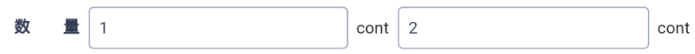

#### 上效果图


#### 实现逻辑
Expanded相当于web的flex
使用Expanded嵌套Text文本框，再用Expanded嵌套左右两部分，完成自适应表单的效果

#### 上代码
```dart
String count1;
String count2;
//是否校验name
bool _nameValidator = true;
//是否校验num
bool _numValidator = false;
//输入框样式
InputDecoration _decoration(placeholder, _validator) {
  return InputDecoration(
    counterText: "", //此处控制最大字符是否显示
    hintText: placeholder,
    contentPadding: EdgeInsets.all(
      10,
    ),
    // 未获得焦点下划线设为灰色
    enabledBorder: OutlineInputBorder(
      borderSide: BorderSide(
        color:
            _validator ? Colors.blue : Colors.red,
        width: 1.0,
      ),
    ),
    //获得焦点下划线设为蓝色
    focusedBorder: OutlineInputBorder(
      borderSide: BorderSide(
        color: _validator ? Colors.blue : Colors.red,
      ),
    ),
    border: OutlineInputBorder(
      borderRadius: BorderRadius.circular(4.0),
    ),
  );
}
//设置文本框
_controller(input) {
  return TextEditingController.fromValue(
    TextEditingValue(
      text: input != null ? input.toString() : "",
      // 保持光标在最后
      selection: TextSelection.fromPosition(
        TextPosition(
          affinity: TextAffinity.downstream,
          offset: input != null ? input.toString().length : 0,
        ),
      ),
    ),
  );
}
//widget
Row(
  children:[
    Expanded(
      child: Row(
        children: <Widget>[
          Expanded(
            child: Container(
              padding: EdgeInsets.only(
                right: 8,
              ),
              child: TextField(
                controller: _controller(1),
                decoration: _decoration('请输入数量', _nameValidator),
                onChanged: (String value) {
                  count1 =value;
                },
              ),
            ),
          ),
          Text(
            "aa",
          ),
        ],
      ),
    ),
    Expanded(
      child: Row(
        children: <Widget>[
          Expanded(
            child: Container(
              padding: EdgeInsets.only(
                left: 8,
                right: 8,
              ),
              child: TextField(
                controller: _controller(2),
                decoration:_decoration('请输入数量', _numValidator),
                onChanged: (String value) {
                  count2 = value;
                },
              ),
            )
          ),
          Text(
            "bb",
          )
        ],
      ),
    ),
  ]
)
```