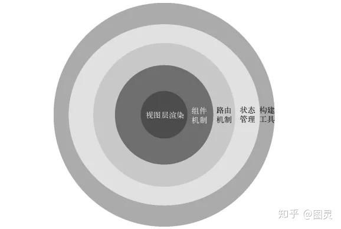

**vue分析版本  2.5.2**
[讨论的地址](https://github.com/berwin/Blog/issues/34)
**元编程**
所谓元编程，就是框架的作者(比如尤大大)使用一种编程语言固有的语言特性(比如javascript的语言特性)，创造相对新的语言特性(比如vue的语法)，使得我们使用者能够以新的(vue的)语法和语义来构建应用程序
**渐进框架**
所谓的渐进框架，就是把框架分层。最核心的部分是视图层渲染，然后往外是组件机制，在这个基础上再加上路由机制，再加入状态管理，最外层是构建工具。

**虚拟DOM**
vue2.0引入了虚拟DOM，其渲染过程变得更快了，但是在80%的情况下更快了，而20%的情况下反而更慢了。任何技术的引入都是在解决一些问题，而通常会引发其他问题。这种情况就要做权衡取舍。
##变化侦测
Vue最独特的特性之一就是**响应式系统**，数据模型是普通的js对象，而当你修改它们时，视图就会更新
**变化侦测**作用是侦测数据的变化，它是响应式系统的核心
从状态生成DOM，再输出到用户界面显示的一整套流程，叫做**渲染**，应用程序运行时会进行不断重新渲染。**重新渲染离不开变化侦测**
####Object的变化侦测
