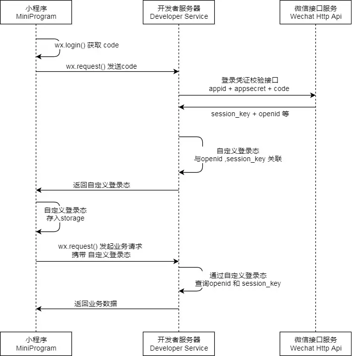

##小程序授权流程

1.调用wx.login生成code
	wx.login()可以获取用户临时的登录凭证code，这个登录凭证只有五分钟。
2.获取openid和session_key
	将code转到开发者服务器，以code换取 用户唯一表示openid和会话密匙session_key
	获取接口
		https://api.weixin.qq.com/sns/jscode2session?appid=APPID&secret=SECRET&js_code=JSCODE&grant_type=authorization_code
  [参考地址](https://juejin.im/post/5ac9b72cf265da23906c486a)
##记录： 
	require 不支持绝对路径
		var common = require('common.js')
	花括号和引号之间如果有空格，将最终被解析成为字符串
	bind事件绑定不会阻止冒泡事件向上冒泡
	catch事件绑定可以阻止冒泡事件向上冒泡。
	capture-事件捕获
		capture-catch将中断捕获阶段和取消冒泡阶段
	dataset
		以data-开头，多个单词以-连接，不要大小写(微信会给你全转小写)
			比如data-aa-bb,会被转成aaBb
				dataset.aaBb
	小程序在微信6.5.3版本中，部分Android机触发不了onLoad事件，可以用onReady替代
##组件通信
parent
```html
<ui-calendar activeday="{{activeday}}" bind:selected="onSelected"></ui-calendar>
```
```js
 onSelected(e){
    // 接受子组件传递来的值
    e.detail.formatdata
}
```
childrem
```js
// 通知父级 并传递formatdata
this.triggerEvent("selected", { formatdata})
```
##脚本
1.将图片保存到本地
```js
  // 事件-保存二维码
  saveCode(){
    // 检测并设置 相册授权
    this.setAuth({
      success:()=>{
        // 存储二维码
        this.save();
      }
    });
  },
  // 存储二维码
  save(){
    wx.saveImageToPhotosAlbum({
      filePath: '/assets/images/code.jpeg',
      success(res) {
        wx.showToast({
          title: '保存成功',
        })
      },
      fail: (res) => {
        // 用户取消了
        if (res.errMsg ==="saveImageToPhotosAlbum:fail cancel") return;
        showToast({
          title: res.errMsg,
        })
      }
    })
  },
  // 检测并设置 相册授权
  setAuth(params){
    wx.getSetting({
      success: function (res) {
        if (res.authSetting['scope.writePhotosAlbum']) {
          // success
          params.success();
        }
        else {
          // 如果用户拒绝授权，这里再弹出引导授权
          wx.openSetting({
            success: res => {
              if (res.authSetting['scope.writePhotosAlbum']) {
                // success
                params.success();
              } else {
                showModal({
                  content: '请通过授权后才能保存二维码'
                })
              }
            }
          })
        }
      },
    })
  }
```
1.转发带ticket值
```js
//app.js
globalData:{
  // 接收 从转发进来的传参(shareTicket)
  shareParames:{}
}
onShow(detail){
  // 转发场景值
  if (detail.scene == 1044) {
    this.globalData.shareParames={
      scene:detail.scene,
      shareTicket: detail.shareTicket,
      class_id: detail.query.class_id
    }
  }
}

//index.js
fn(){
  // 如果不是从转发进来的，那就是直接进入页面的
  if (app.globalData.shareParames.scene!=1044) {
    this.getList();//自定义方法 获取列表
    return;
  }
  //如果登录session失效，那么调后端接口会失败
  wx.checkSession({
    success:()=>{
      //调微信API 获取转发详细信息
      this.getGroupPram(parame => {
        //parame:class_id、gopen_data、iv
      })
    })
  })
}
getGroupPram(callback) {
  // 获取转发详细信息
  wx.getShareInfo({
    shareTicket: app.globalData.shareParames.shareTicket,
    success: (res) => {
      callback({
        class_id: app.globalData.shareParames.class_id,
        gopen_data: res.encryptedData,
        iv: res.iv
      })
      console.log('获取转发状态：', res.errMsg)
      // console.log('解密后为一个 JSON 结构（openGId    群对当前小程序的唯一 ID）', res.encryptedData)
      // console.log('加密算法的初始向量', res.iv)
    },
    fail() {
      console.log('index fail getGroupPram 获取转发详细信息')
    },
    complete() {
      console.log('index fail getGroupPram 获取转发详细信息')
    }
  });
},
```
1.滑动翻页
```js
data:{
  // 滑到底部显示加载中…
  hide_loading:true,
  // 是否最后一页，默认不是最后一页
  is_end:false,
}
// 获取课程列表-获取第一页
  getCourseList(page){
    // 加载当前页数据
    apiShowCalendar(app.globalData.class_id, {
      page
    }).then(result => {
      // 隐藏加载中效果
      this.setData({
        hide_loading: true,
      })
      let courseList = result.data;
      // 第2页及以后页
      if (this.data.courseList.length > 0 && courseList.length>0){
        // 数组追加
        courseList = this.data.courseList.concat(courseList)
      }else{
        // 第一页
        if (this.data.courseList.length === 0) {
          courseList = result.data;
        }else{
          // 最后一页了
          this.setData({
            is_end: true
          })
          return;
        }
      }

      this.setData({
        courseList,
      })
    })
  },
  /**
   * 页面上拉触底事件的处理函数
   */
  onReachBottom: function (e) {
    // 如果没有数据了，就不要执行了
    if (this.data.is_end) return;
    // 滑动到底部，显示正在加载中…
    this.setData({
      hide_loading: false
    })
    // 每次翻页加1
    let page = this.data.page + 1;
    this.setData({
      page
    })
    // 加载下一页
    this.getCourseList(page);
  },
```
```html
<view hidden='{{hide_loading}}' class='pt30 f26 tc c9 flex v_center l_center'>
  <image mode="aspectFit" src="../../assets/images/loading.gif" class='icon_loading mr20'></image>
  <text>正在加载中…</text>
</view>
```
1.授权
```js
//引入弹窗
import * as layer from "../../utils/layer";
onLoad: function (options) {
  // 获取用户设置
  wx.getSetting({
    success: (res) => {
      // 如果允许过授权
      if (res.authSetting['scope.userInfo']) {
        // 允许授权
      } else {
        // 不允许授权
        this.popupAuth();
      }
    },
    fail() {
      // 不允许授权
      this.popupAuth();
    }
  })
},
// 弹授权
popupAuth(){
  layer.popup().then((res) => {
    if (res.type == 'confirm') {
      
    }
  })
},
// 手机号授权
isAuthPhone(bool) {
  if (bool) {
    layer.dialogPhone(layer.dialogPhone)
  }
},
// 监听手机号授权
childGetPhone(e) {
  console.log('phone',e)
  let obj = e.detail.detail.detail;
  apiSetPhone(obj).then(res => {
    if (res.data.code == 1) {
      app.globalData.has_tel = true;
    }
  })
},
childGetUserinfo(){
  // 如果登录了-跳上一步
  wx.navigateBack({
    delta: 1
  })
}
```
```html
```
1. 文件作用域
	通过app=getApp()可以获取全局的应用实例
  ```js
    //设置全局数据
    app.globalData.sayHi='hello'
    //或者在app.js中
    app({
      globalData:{
        sayHi:'hello'
      }
    })
    //任意页面获取
    app.globalData.sayHi
  ```
##笔记
###方法
  ```js
    //app.js:
    App({//不能调用getApp(),取实例用this
      onLaunch: function() {
        // 不能用getCurrentPage()，此时 page 还没有生成。
      },
      onShow: function() {
          //当小程序启动，或从后台进入前台显示，会触发 onShow
      },
      onHide: function() {
          // 当小程序从前台进入后台，会触发 onHide
      },
      globalData: 'I am global data'
    })
  ```
1. wx.navigateTo
  接收页面参数：可以获取wx.navigateTo和wx.redirectTo及<navigator/>中的 query
	不允许跳转到tabbar页面
1. wx.switchTab
	可以跳转到tabbar页面
1. wx.setNavigationBarTitle
  对界面的设置
  设置标题
  如：wx.setNavigationBarTitle请在onReady之后设置。
1. wx.login()
  登录
1. wx.getUserInfo
  获取用户信息
1. wx.getStorageSync('logs') || []
  读取本地缓存
1. wx.setStorageSync('logs', logs)
  设置本地缓存
1. 对象-globalData
  设置：this.globalData.userinfo=obj;
  读取：this.globalData.userinfo
1. 数组中添加值
  logs.unshift(Date.now())
1. 数组-for
  ```html
  <view wx:for="{{array}}" wx:for-index="idx" wx:for-item="itemName"> {{index}}: {{item.message}} </view>
  <view wx:for="{{[zero, 1, 2, 3, 4]}}"> {{item}} </view>
  <!-- 使用 wx:for-item 可以指定数组当前元素的变量名， -->
  <!-- 使用 wx:for-index 可以指定数组当前下标的变量名 -->
	  <!-- wx:key的两种形式 -->
		  <!-- 1.wx:key="index" -->
		  <!-- 2.wx:key="*this" -->
			  <!-- 保留关键字 *this 代表在 for 循环中的 item 本身，这种表示需要 item 本身是一个唯一的字符串或者数字 -->
			  <switch wx:for="{{numberArray}}" wx:key="*this" style="display: block;"> {{item}} </switch>
  ```

###对象
```html
<template is="objectCombine" data="{{for: a, bar: b}}"></template>
<template is="objectCombine" data="{{...obj1, ...obj2, e: 5}}"></template>
```
###事件
1. bindtap
  点击事件
1. bindchange
  checkbox选中事件
1. 事件(bind事件绑定不会阻止冒泡事件向上冒泡，catch事件绑定可以阻止冒泡事件向上冒泡)：
    * 冒泡：
      ```
      touchstart  手指触摸动作开始
      touchmove 手指触摸后移动
      touchcancel 手指触摸动作被打断，如来电提醒，弹窗
      touchend  手指触摸动作结束
      tap 手指触摸后马上离开
      longtap 手指触摸后，超过350ms再离开（推荐使用longpress事件代替）
      longpress 手指触摸后，超过350ms再离开，如果指定了事件回调函数并触发了这个事件，tap事件将不被触发
      transitionend 会在 WXSS transition 或 wx.createAnimation 动画结束后触发	
		animationstart 会在一个 WXSS animation 动画开始时触发	
		animationiteration 会在一个 WXSS animation 一次迭代结束时触发	
		animationend 会在一个 WXSS animation 动画完成时触发	
		touchforcechange 在支持 3D Touch 的 iPhone 设备，重按时会触发
      ```
    * 非冒泡：
      ```
      submit <form/>的submit事件
      scroll <scroll-view/>的scroll事件
      <input/> 的input事件
      ```
###wxml:
使用 wx:for-item 可以指定数组当前元素的变量名，
使用 wx:for-index 可以指定数组当前下标的变量名：
```html
<view wx:for="{{array}}" wx:for-index="idx" wx:for-item="itemName">
  {{idx}}: {{itemName.message}}
</view>
```
template模板
	模板拥有自己的作用域，只能使用 data 传入的数据以及模版定义文件中定义的 <wxs /> 模块
	使用 is 属性，声明需要的使用的模板
  ```
	<template is="msgItem" name="msgItem">
	  <view>
	    <text> {{index}}: {{msg}} </text>
	    <text> Time: {{time}} </text>
	  </view>
	</template>
  ```
block不会渲染的元素
	<block/> 并不是一个组件，它仅仅是一个包装元素，不会在页面中做任何渲染，只接受控制属性
  ```
  <block wx:if="{{true}}">
    <view> view1 </view>
    <view> view2 </view>
  </block>
  ```
###wxss:
rpx:规定屏幕宽为750rpx。1rpx=1物理像素。例如iphone6，1px=2rpx(750/375屏幕宽度)，10px=750rpx(750/375*10)
rem:规定屏幕宽为20rem,1rem=(750/20)rpx.例如ihone6,1px=屏幕宽度375/750=0.5,0.5*37.5=18.5,所以1rem=18.5

##小程序rich-text里多张图片自适应
  ```js
  this.setData({
		detail_tb: res.data.replace(/\slot内容</ui-nav-bar>
		
## 点击事件捕获
	一般来说，这样可以获取点击元素的data-id属性
		e.target.dataset.id
	但是有时就发生捕获，点击当前却获取了元素属性
		我的解决方案是：
		e.currentTarget.dataset.id;
## swiper轮播图
圆点位置上移
```css
		.wx-swiper-dots{
		  position:absolute;top:216rpx;
		}
```

## radio样式重写
```html  
	  <radio-group class="radio-group" bindchange="radioChange">
			<view class="radio_attr">
					<label class="f36" data-index="0" bindtap="changeRadio">
						<radio value="0"/>
						<text class="{{selected[0]}}">文科</text>  
					</label>
			</view>
			<view class="radio_attr">
					<label class="f36" data-index="1" bindtap="changeRadio">
						<radio value="1" checked='true'/>
						<text class="{{selected[1]}}">理科</text>
					</label>
			</view>
		</radio-group>
```
```js
data: {
    selected: { 0: "colorGray" }
  },
  changeRadio: function(e){//修改字体颜色
    let index = e.currentTarget.dataset.index;
    let selected = { 0: "colorGray", 1:"colorGray"};
    selected[index] = "";
    this.setData({
      selected: selected
    })
  }
```
```css
	.colorGray{
    color:#cacaca;
  }
  .radio-group{
    height:34rpx;
    display: flex;
    align-items: center;
  }
  .radio_attr {
    padding:0 50rpx 0 45rpx;
    position:relative;
  }
  .radio_attr label{
    display: flex;
  }
  /*radio默认样式重置*/
  radio {
    background: none;
  }
  radio .wx-radio-input {
    position: absolute;
    top:50%;left:0;
    width: 25rpx;
    height: 25rpx;
    transform:translate(0,-50%);
  }
  radio .wx-radio-input.wx-radio-input-checked {
    /*必须要优先级最高-否则会被默认样式影响*/
     border-color:#2b9cff!important;
    background: #2b9cff!important;
  }
   
  radio .wx-radio-input.wx-radio-input-checked::before {
    content: '';/*清楚默认样式*/
  }
  /*radio默认样式重置*/
```