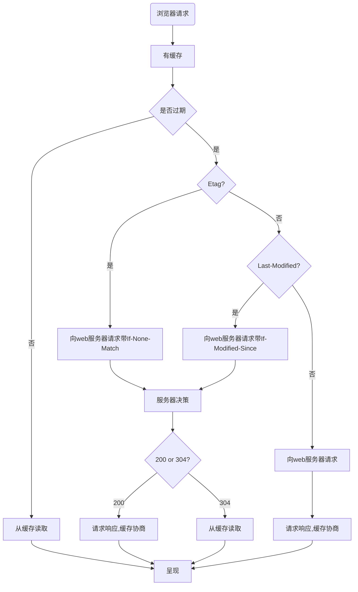

## Nginx服务器缓存策略
```nginx
# 设置缓存 etag默认是开启的
etag on;
# gzip打开压缩  Content-Encoding: gzip
gzip on;
# 设置 告诉浏览器别去缓存它
add_header Cache-Control no-cache; #强制每次请求直接请求原服务器
```
### 解决命中强缓的问题
**问题：当设置no-cache，依然命中from disk cache或from memory cache**
配置nginx，建议同时增加三个header
```nginx
server{
      location / {
        ...
           add_header         Pragma   no-cache;
           add_header         Expires  0;
           add_header         Cache-Control no-cache,no-store,must-revalidate;
      }
}
```
```
有时光是no-cache不够的，Cache-Control 参数的解释：

no-cache — 强制每次请求直接发送给源服务器，而不经过本地缓存版本的校验。这对于需要确认认证应用很有用（可以和public结合使用），或者严格要求使用最新数据的应用（不惜牺牲使用缓存的所有好处）；
no-store — 强制缓存在任何情况下都不要保留任何副本；
must-revalidate — 告诉缓存必须遵循所有你给予副本的新鲜度的，HTTP允许缓存在某些特定情况下返回过期数据，指定了这个属性，你是在告诉缓存（服务器，浏览器，代理等），你希望严格地遵循你的规则。
```

### 配置expires
* 可以在http段中或者server段中或者location段中加入
* expires，适合jquery这种30年不过期的文件
```nginx
# expires max; # 过期时间戳，"Cache-Control"的值为10年

# 图片强缓30天
location ~ \.(gif|jpg|jpeg|png|bmp|ico)$ {
    root /vr/www/img/;
    expires 30d;
}
```

