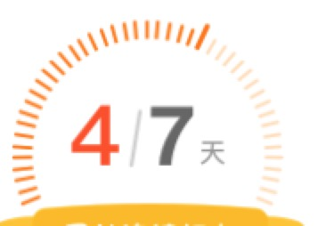

### 图例


### 脚本
``` js
// 调用
drawScale("canvas_id", 7 , 4)
// 画刻度
export function drawScale(el, count, current) {
    let myCanvas = document.getElementById(el);
    let width = myCanvas.width,
        height = myCanvas.height;
    var c = myCanvas.getContext('2d');
    c.save();
    // c.translate(155,164);
    c.translate(width / 2, height / 1.33);
    //c.rotate(-220 * Math.PI / 180);
    c.rotate(-240 * Math.PI / 180);
    //分钟刻度线
    for (var i = 0; i < 84; i++) {    //画12个刻度线
        c.beginPath();
        c.strokeStyle = "#FFDBB4";
        c.lineWidth = 4;
        c.moveTo(195, 195);
        c.lineTo(210, 210);
        c.stroke();
        c.rotate(Math.PI / 70); //每个6deg画一个时钟刻度线
        c.closePath();
    }
    c.restore();

    c.save();
    c.translate(width / 2, height / 1.33);
    c.rotate(-240 * Math.PI / 180);
    //分钟刻度线
    var len = parseInt((current / count) * 84);
    for (var i = 0; i < len; i++) {    //画12个刻度线
        c.beginPath();
        c.strokeStyle = "#FD7400";
        if (i == len - 1) {
            c.lineWidth = 6;
            c.moveTo(218, 218);
            c.lineTo(195, 195);
        } else {
            c.lineWidth = 4;
            c.moveTo(195, 195);
            c.lineTo(210, 210);
        }
        c.stroke();
        c.rotate(Math.PI / 70); //每个6deg画一个时钟刻度线
        c.closePath();
    }
    c.restore();

    //文字-信用度
    //c.textAlign = "center";
    c.fillStyle = '#FD4F1F';
    // ctx.fillText('信用' + creditTxt, 225, 314);
    //文字-信用数
    c.font = "400 192px microsoft yahei";
    c.fillText(current, 130, 300);

    c.fillStyle = '#ccc';
    c.font = "100 132px microsoft yahei";
    c.fillText("/", 260, 284);

    c.fillStyle = '#ccc';
    c.font = "400 192px microsoft yahei";
    c.fillText(count, 346, 300);

    c.fillStyle = '#999';
    c.font = "100 60px microsoft yahei";
    c.fillText('天', 440, 296);

}
```